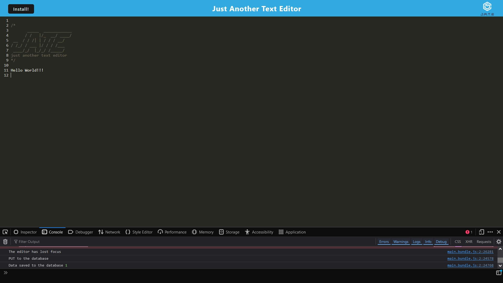
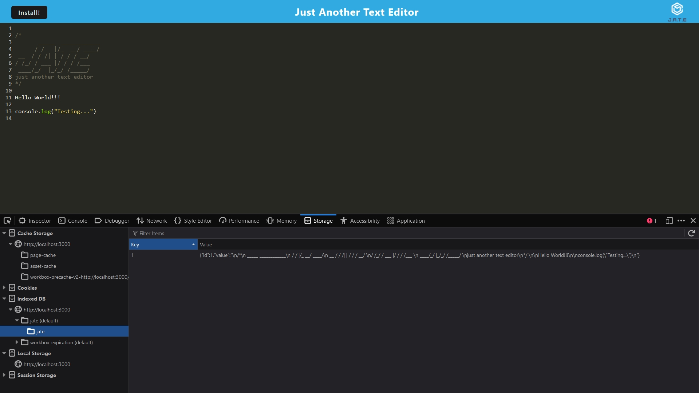
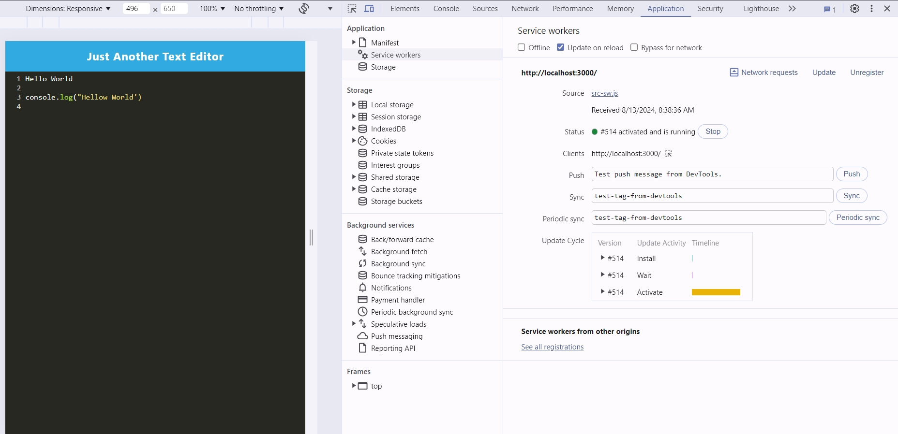
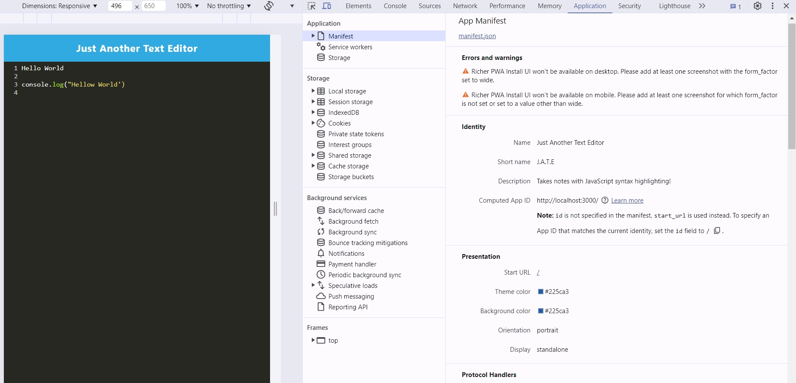

# PWA - J.A.T.E (Just Another Text Editor)

## Table of Contents

- [PWA - J.A.T.E (Just Another Text Editor)](#pwa---jate-just-another-text-editor)
  - [Table of Contents](#table-of-contents)
  - [Description](#description)
  - [Technologies and Packages Used](#technologies-and-packages-used)
  - [Installation](#installation)
  - [Usage](#usage)
    - [Application Deployed on Render](#application-deployed-on-render)
    - [Screenshots of the Application](#screenshots-of-the-application)
  - [Credits](#credits)
  - [License](#license)

## Description

This a progressive web application, "PWA" in the form of a text editor. The application uses [Express.js](https://expressjs.com/) for handling the routes and server as well as several packages for building and managing the PWA such as those from [Babel](https://babeljs.io/docs/usage), [Webpack](https://webpack.js.org/guides/getting-started/). The [Node language manager](https://expressjs.com/) uses those packages to build and run the application.

## Technologies and Packages Used

- [Node.js](https://nodejs.org/en)
- [Express.js](https://expressjs.com/)
- [Babel]()
- [Concurrently]()
- [Webpack]()
- [Workbox]()
- [Cache]()
  
## Installation

This is a full functioning application deployed at [this link](https://pwa-jate-zgyl.onrender.com/). On that page there is a button named "Install" that will install this application as on offline app on a local system. After the install a shortcut icon will be created that will open up the application from the local system.

## Usage

This application is a text editor that will store user inputted text in their local IndexDB and local storage. Data will persist even when the app is refreshed or closed. Upon opening the app again, the stored entries in the local system will be populated.

If a user opens up the Dev Tools logs of the data being stored in the IndexDB and local storage can be seen. Also there, a user can see the service workers running and the application manifest.

### Application Deployed on Render

Follow [this link](https://pwa-jate-zgyl.onrender.com/) to visit this application's page and install it locally.

### Screenshots of the Application

## Credits

N/A
  
## License

This project is licensed under 

Please see the [License](https://opensource.org/licenses/MIT) page for more info.

